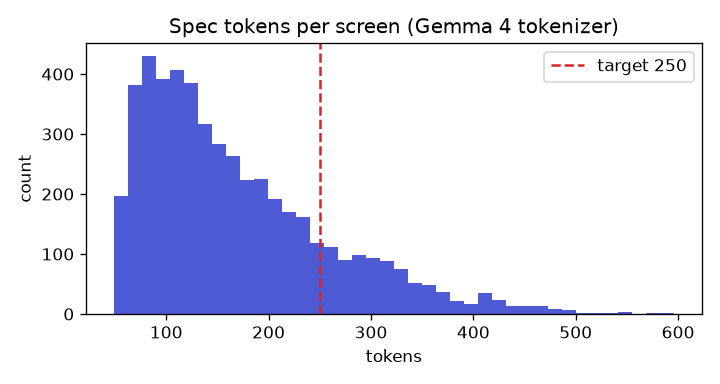
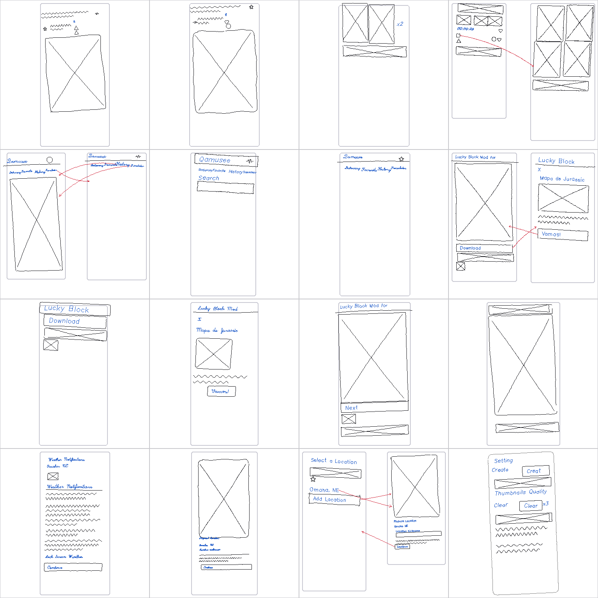
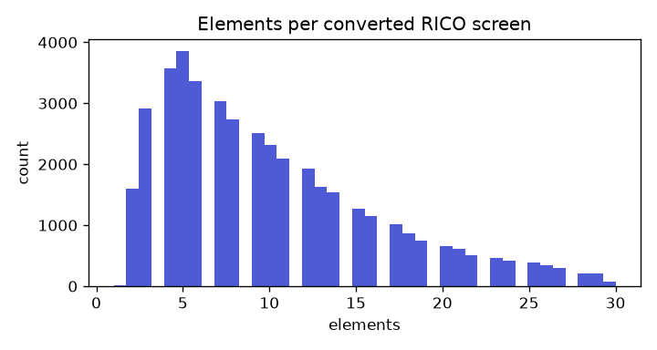

# Data report

Generated by `python -m s2a.data.report` from the pipeline's own outputs; nothing here is hand-edited.

## 1. RICO -> UI specs

Source: RICO semantic annotations, 66,261 screens (JSON hierarchies only, no screenshots).

| Outcome | Screens |
|---|---:|
| ok | 42,313 |
| overlay | 10,552 |
| too_few | 7,702 |
| non_latin | 1,980 |
| too_many | 1,979 |
| empty_body | 1,616 |
| not_portrait | 119 |

Kept screens satisfy: portrait, no drawer/modal overlay, mostly Latin text (ML Kit reads en-US), 3-30 sketchable elements, valid against the schema after conversion.

Elements per kept screen: median 9, p10 3, p90 19.

Spec size (canonical JSON, Gemma 4 tokenizer, 5,000 random screens): median **144** tokens/screen, p90 302, max 596 (target: median < 250). 

Node types in converted specs:

| Type | Count |
|---|---:|
| text | 202,052 |
| row | 80,862 |
| col | 79,082 |
| img | 76,396 |
| icon | 62,463 |
| btn | 26,795 |
| para | 26,283 |
| appbar | 23,410 |
| list | 14,204 |
| input | 13,892 |
| avatar | 12,025 |
| card | 8,220 |
| check | 5,068 |
| switch | 1,361 |
| fab | 1,126 |
| grid | 668 |
| radio | 391 |
| bottomnav | 115 |

## 2. Splits (by app)

Apps are assigned to train/val/test by a hash of the package name, so no app appears in two splits.

| Split | Apps | Specs | Samples | 1 screen | 2 screens | 3 screens | Failed | Strokes/sample (median, p90) |
|---|---:|---:|---:|---:|---:|---:|---:|---|
| train | 6,279 | 33,600 | 33,560 | 23,486 | 5,311 | 4,763 | 40 | 94, 271 |
| val | 830 | 4,448 | 4,440 | 3,156 | 691 | 593 | 8 | 94, 278 |
| test | 753 | 4,265 | 4,265 | 3,065 | 616 | 584 | 0 | 98, 269 |

## 3. Synthetic sketches

Every sample is laid out by our own randomised layout (not the app's pixels) and drawn per the sketch legend, so sketch and gold spec always agree. Noise model (configs/data.yaml):

| Parameter | Range |
|---|---|
| pen.jitter_px | [0.3, 1.2] |
| pen.wobble | [0.003, 0.015] |
| pen.overshoot | [0.0, 0.12] |
| pen.rounding | [0.0, 0.18] |
| pen.closure_gap | [0.0, 0.04] |
| pen.multi_stroke_rect | [0.05, 0.4] |
| pen.retrace | [0.0, 0.12] |
| pen.broken | [0.0, 0.06] |
| pen.point_step_px | [1.5, 3.5] |
| transform.rotation_deg | [-3.0, 3.0] |
| transform.scale | [0.92, 1.08] |
| transform.shear | [-0.04, 0.04] |
| transform.element_offset | 0.012 |
| order.shuffled_prob | 0.2 |
| canvas.drawn_frame_prob | 0.25 |
| layout.list_mark_prob | 0.65 |
| multiscreen.share | 0.3 |

Element types in the train split:

| Element | Count |
|---|---:|
| text | 211,345 |
| icon | 94,338 |
| img | 86,780 |
| para | 30,184 |
| btn | 29,236 |
| appbar | 26,855 |
| heading | 21,367 |
| input | 15,302 |
| avatar | 13,859 |
| listmark | 11,913 |
| card | 10,167 |
| menu | 9,192 |
| check | 5,845 |
| switch | 1,636 |
| radio | 1,509 |
| fab | 1,354 |
| bottomnav | 147 |

Stroke classes in the first train shard (65,914 strokes): text 81.4%, shape 16.4%, arrow 1.7%, frame 0.5%.

Random training samples (shape strokes black, handwriting blue, arrows red, drawn frames grey):





## 4. Example converted spec

```json
{"v":1,"screens":[{"id":"screen","title":"Wildfire","appbar":{"t":"appbar","title":"Wildfire","icons":[{"t":"icon","name":"favorite"},{"t":"icon","name":"more"}]},"body":{"t":"col","c":[{"t":"switch","label":"Setting"},{"t":"row","c":[{"t":"text","v":"MAP VIEW","s":"link"},{"t":"text","v":"LIST VIEW","s":"link"},{"t":"icon","name":"refresh"}]}]}}]}
```
